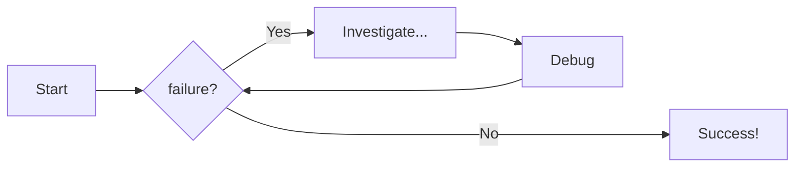
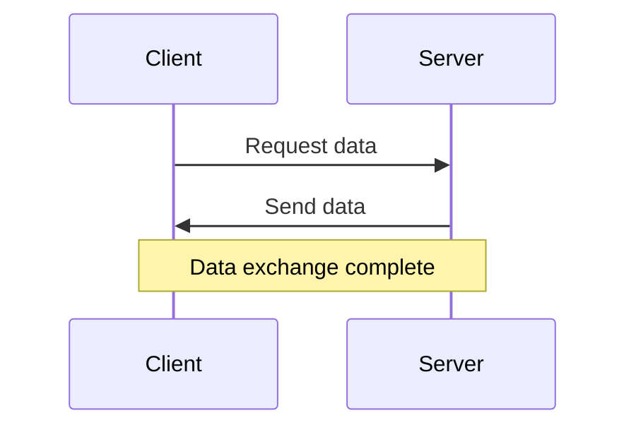

# Diagram Examples

## Flowchart

```mermaid
graph LR
  A[Start] --> B{failure?};
  B -->|Yes| C[Investigate...];
  C --> D[Debug];
  D --> B;
  B ---->|No| E[Success!];
```

## Sequence Diagram

```mermaid
sequenceDiagram
    participant C as Client
    participant S as Server

    C->>S: Request data
    S->>C: Send data
    Note over C, S: Data exchange complete
```